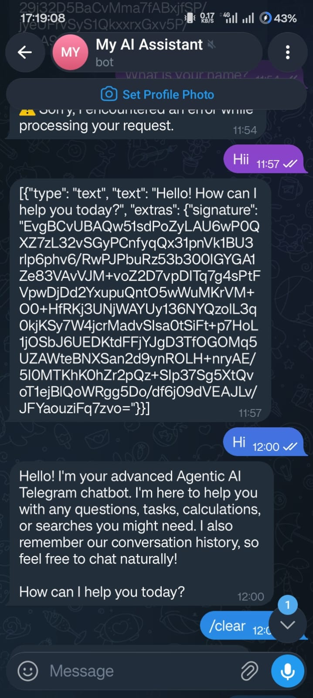
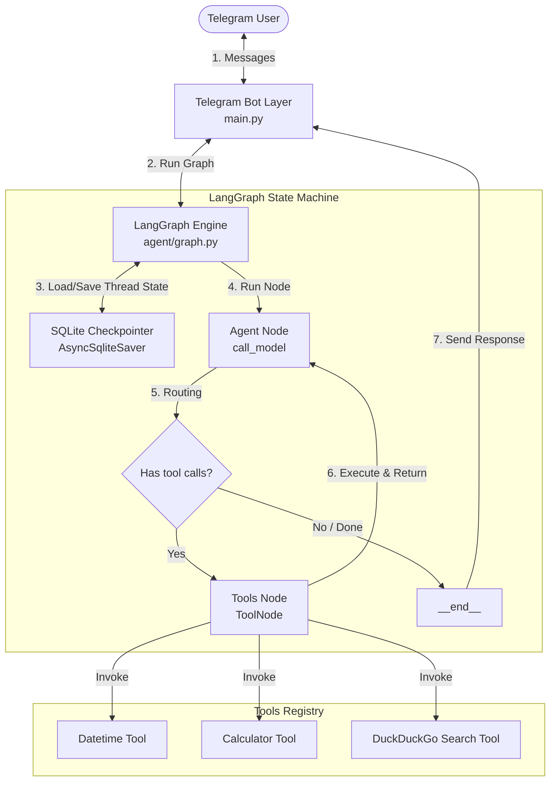

# Agentic AI Telegram Chatbot

An intelligent, stateful Telegram chatbot built using **LangGraph**, the **Gemini 2.5 Flash** model (via LangChain), and **python-telegram-bot**. The chatbot runs as an agent that can dynamically decide when to call tools (such as web search, date/time retrieval, and safe math calculation) and persists conversational state across user sessions using an asynchronous SQLite checkpointer.

<p align="center">
  
</p>

---

## Architecture & Workflow

### Architectural Diagram



### Detailed Processing Workflow

1. **User Input**: A user sends a message to the bot on Telegram.
2. **Bot Handler (`main.py`)**:
   - The bot receives the text, triggers a typing action, and calls the LangGraph instance.
   - The telegram `chat_id` is passed as the `thread_id` to separate conversational state for each user.
3. **Graph Initialization**:
   - LangGraph loads the existing conversation history for the given `thread_id` from the SQLite database (`data/checkpoints.db`).
   - The new message is appended to the message list.
4. **Agent Invocation (`agent/graph.py`)**:
   - The list of messages (prepended with a System Message defining the agent persona) is sent to the Gemini 2.5 Flash model.
   - Gemini decides whether to respond directly to the user or call one or more registered tools.
5. **Tool Execution Loop**:
   - If Gemini requests tool calls (e.g., `web_search` or `calculate_expression`), the graph transitions to the `tools` node.
   - The requested tools are executed, and their outputs are appended to the message history as `ToolMessage` instances.
   - The graph transitions back to the agent node, supplying the tool outputs. Gemini processes the updated context to generate its response.
6. **Completion**:
   - Once Gemini is finished and requests no further tool executions, the graph transitions to `__end__`.
   - The updated message list is checkpointed back to SQLite.
   - The bot sends the final response back to the user on Telegram.

---

## Directory Structure

```text
telegram-bot/
├── data/
│   └── checkpoints.db      # Automatically created SQLite database for thread persistence
├── agent/
│   ├── __init__.py
│   ├── graph.py           # LangGraph StateGraph definition & AsyncSqliteSaver setup
│   └── tools.py           # Registered tools (datetime, calculator, web search)
├── utils/
│   └── logger.py          # Centralized stdout logger
├── config.py              # Environment variable loading & validation
├── main.py                # Main runner setting up Telegram Bot events
├── test_agent.py          # Offline mock-run test script for validation
├── requirements.txt       # Project python dependencies
├── .env                   # Local configuration file (contains secret keys)
└── .env.example           # Example configuration file
```

---

## Tools Included

1. **Date/Time Tool**: Returns the current local system date and time.
2. **Calculator Tool**: Evaluates mathematical expressions safely using an AST-based parser. Supports operations like `+`, `-`, `*`, `/`, `**`, `abs()`, `round()`, `min()`, `max()`, and `sum()`.
3. **Web Search Tool**: Asynchronously queries DuckDuckGo HTML search and parses page snippet results for up-to-date facts and news.

---

## Setup & Running Instructions

### 1. Prerequisites
Ensure you have Python 3.10+ installed on your system.

### 2. Setup Virtual Environment & Install Dependencies
Run the following commands in the root of the project directory:
```bash
# Create a virtual environment
python3 -m venv venv

# Activate virtual environment
source venv/bin/activate

# Install dependencies
pip install -r requirements.txt
```

### 3. Configure Credentials
Create a `.env` file in the root directory (copied automatically from `.env.example` if not present) and add your actual credentials:
```env
TELEGRAM_BOT_TOKEN=your_telegram_bot_token_here
GEMINI_API_KEY=your_gemini_api_key_here
```
* **TELEGRAM_BOT_TOKEN**: Can be obtained by creating a bot via [@BotFather](tg://user?id=BotFather) on Telegram.
* **GEMINI_API_KEY**: Can be obtained via the Google AI Studio Console at [aistudio.google.com](https://aistudio.google.com/).

### 4. Run Offline Test Suite (Optional)
To verify that the Gemini API integration, tool-calling loop, and SQLite persistence are working correctly without needing a Telegram Bot Token, run the test script:
```bash
python test_agent.py
```
This script runs a mock conversation, triggers tool calling, and validates memory recall.

### 5. Start the Telegram Bot
Run the main entrypoint:
```bash
python main.py
```
The bot will output polling updates to the terminal. You can now chat with your bot on Telegram. Send `/clear` at any time to reset your conversation history.
